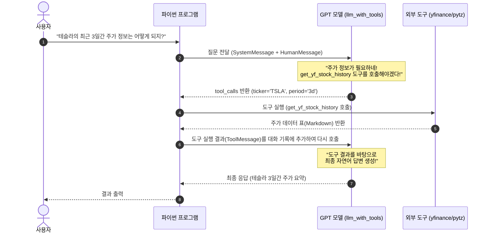
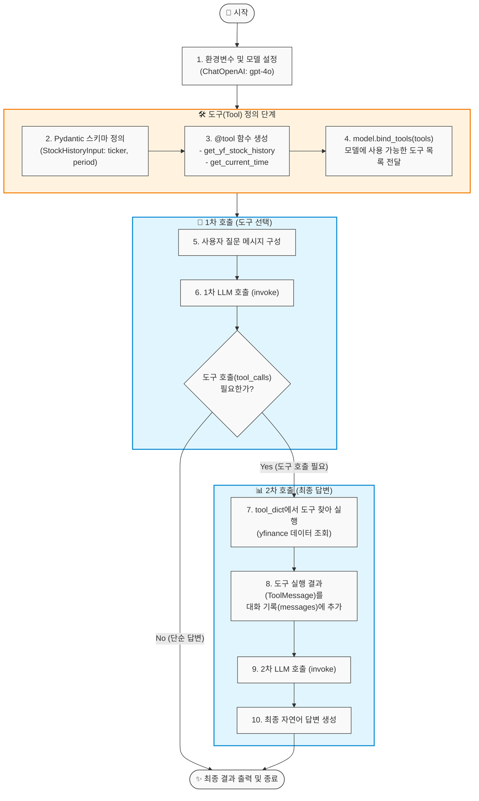

# 15_pydantic.py 완전 정복 가이드 (초보자용)

`15_pydantic.py`는 **LangChain의 도구 호출(Tool Calling / Function Calling)**과 **Pydantic을 활용한 입력값 검증**을 구현한 코드입니다.

---

## 1. 한눈에 보는 전체 흐름 (Mermaid Sequence Diagram)

아래 다이어그램은 사용자의 질문부터 최종 답변이 나오기까지의 전체 과정을 보여줍니다.



---

## 2. 세부 동작 흐름도 (Mermaid Flowchart)



---

## 3. 핵심 코드 상세 설명

### ① Pydantic을 이용한 입력값 규격 정의 (`StockHistoryInput`)
```python
from pydantic import BaseModel, Field

class StockHistoryInput(BaseModel):   
    ticker: str = Field(..., title='주식코드', description='주식 코드 (예: AAPL, TSLA)')
    period: str = Field(..., title='기간', description='주식 데이터 조회 기간 (예: 1d, 1mo, 1y)')
```
- **왜 쓰나요?**: LLM이 도구를 실행할 때 어떤 파라미터(`ticker`, `period`)가 필요한지, 어떤 형식이어야 하는지 명확한 **설명서** 역할을 합니다.
- `...` (Ellipsis): 필수 입력값임을 의미합니다.
- `description`: LLM이 이 값을 어떤 용도로 채워 넣어야 하는지 이해하는 힌트가 됩니다.

---

### ② 도구(Tool) 등록 (`@tool`)
```python
@tool(args_schema=StockHistoryInput)
def get_yf_stock_history(ticker: str, period: str) -> str:
    """ 주식 종목의 가격 데이터를 조회하는 함수 """
    stock = yf.Ticker(ticker)
    history = stock.history(period=period)
    return history.to_markdown()
```
- `@tool(args_schema=StockHistoryInput)`: 파이썬 함수를 LangChain 도구로 변환하고 위에서 만든 Pydantic 스키마를 연결합니다.
- 함수의 **docstring(`""" 주식 종목의... """`)**은 LLM이 "이 도구가 언제 필요한지" 판단하는 기준이 됩니다.

---

### ③ 모델과 도구 바인딩 (`bind_tools`)
```python
tools = [get_yf_stock_history, get_current_time]
tool_dict = {
    "get_current_time": get_current_time,
    "get_yf_stock_history": get_yf_stock_history
}
llm_with_tools = model.bind_tools(tools)
```
- `model.bind_tools(tools)`: LLM에게 "너는 이제 이 2가지 도구를 사용할 수 있어"라고 알려줍니다.
- `tool_dict`: 나중에 LLM이 요청한 도구 이름(문자열)으로 실제 파이썬 함수를 찾아 실행하기 위한 사전입니다.

---

### ④ 2단계(2-Turn) 실행 흐름
1. **1단계 (도구 호출 요청)**:
   ```python
   response = llm_with_tools.invoke(messages)
   # response.tool_calls 에 [{'name': 'get_yf_stock_history', 'args': {'ticker': 'TSLA', 'period': '3d'}, ...}] 가 담김
   ```
2. **파이썬이 도구 직접 실행**:
   ```python
   for tool_call in response.tool_calls:
       selected_tool = tool_dict.get(tool_call['name'])
       tool_msg = selected_tool.invoke(tool_call) # 실제 yfinance 함수 실행
       messages.append(tool_msg)                   # 결과를 대화 목록에 추가
   ```
3. **2단계 (최종 답변 생성)**:
   ```python
   response = llm_with_tools.invoke(messages) # 결과 데이터를 참고하여 사용자가 읽기 좋은 문장으로 변환
   print(response.content)
   ```

---

## 4. 요약 정리

| 구성 요소 | 역할 | 비유 |
| :--- | :--- | :--- |
| **`BaseModel (Pydantic)`** | 도구 매개변수의 규격 및 설명 정의 | 주문서 양식 |
| **`@tool` 함수** | 실제로 데이터를 가져오는 파이썬 함수 | 실제 일하는 직원 |
| **`bind_tools`** | LLM에게 사용 가능한 도구 목록 등록 | 직원의 사용 설명서를 AI에게 전달 |
| **`1차 invoke`** | AI가 도구 실행 필요 여부 및 인자 결정 | AI가 주문서 작성 |
| **`2차 invoke`** | 실행 결과를 바탕으로 최종 문장 생성 | AI가 완성된 요리(답변) 서빙 |
