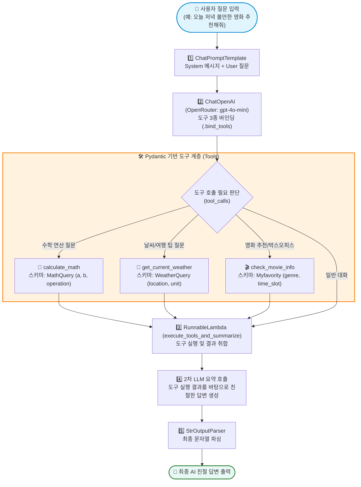
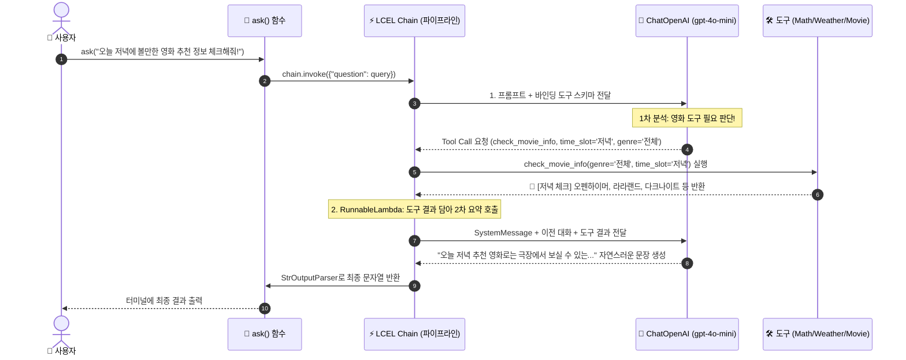

# 🎬 mymathjeju.py 초보자 가이드 & 구조도 (Mermaid)

`mymathjeju.py`는 **Pydantic 데이터 검증**, **LangChain Tool(@tool)**, **LCEL(LangChain Expression Language) 파이프라인**, 그리고 **OpenRouter AI 모델(`openai/gpt-4o-mini`)**을 결합하여 수학 계산, 제주 날씨 안내, 영화 추천/박스오피스 체크를 자동으로 수행하는 지능형 도구 에이전트입니다.

---

## 📊 1. 한눈에 보는 전체 시스템 구조도 (Flowchart)

사용자가 질문을 입력하면 AI가 질문을 분석하여 어떤 도구를 쓸지 스스로 판단하고, 도구 실행 결과를 취합하여 최종적인 자연어 답변을 작성합니다.



> **저장된 다이어그램 이미지**: `images2/mymathjeju_flowchart.png`

---

## ⏱️ 2. 도구 호출 및 실행 시퀀스 (Sequence Diagram)



> **저장된 시퀀스 이미지**: `images2/mymathjeju_sequence.png`

---

## 🧩 3. 핵심 구성 요소 상세 설명 (초보자용)

### 1️⃣ Pydantic 데이터 검증 스키마
AI가 함수를 호출할 때 넘겨줄 인자의 타입과 설명을 정의하는 규격입니다.
* `MathQuery`: 두 숫자 `a`, `b`와 사칙연산 종류 `operation`(`add`, `subtract`, `multiply`, `divide`, `abs`)을 검증합니다.
* `WeatherQuery`: 지역명 `location`과 온도 단위 `unit`을 검증합니다.
* `Myfavority`: 관심 장르 `genre`와 시간대 `time_slot`(`아침`, `오후`, `저녁`)을 검증합니다.

```python
class Myfavority(BaseModel):
    genre: str = Field(default="전체", description="영화 장르")
    time_slot: str = Field(default="오후", description="하루 3번 체크 시간대 ('아침', '오후', '저녁')")
```

---

### 2️⃣ LangChain 도구 데코레이터 (`@tool`)
일반 파이썬 함수에 `@tool(args_schema=...)`을 붙여 AI가 읽고 호출할 수 있는 도구 형태로 등록합니다.
* `calculate_math`: 덧셈, 뺄셈, 곱셈, 나눗셈, 절댓값 연산 수행
* `get_current_weather`: 제주, 서울, 부산 등의 날씨와 맞춤 여행 팁 반환
* `check_movie_info`: 하루 3번 시간대별 신작, 박스오피스, 퇴근길 추천 영화 반환

---

### 3️⃣ LCEL 체인 파이프라인 (`|` 파이프 연산자)
복잡한 AI 처리 과정을 단 하나의 파이프라인으로 연결합니다.

```python
chain = (
    prompt                                     # 1. 시스템 및 사용자 프롬프트 생성
    | llm_with_tools                           # 2. 도구가 바인딩된 LLM 모델에 질문 전달
    | RunnableLambda(execute_tools_and_summarize) # 3. 도구 실행 및 2차 자연어 요약
    | StrOutputParser()                        # 4. 문자열 파서로 텍스트 추출
)
```

---

## 💡 4. 실행 예시 4가지 시나리오

1. **영화 저녁 추천**: `ask("오늘 저녁에 볼만한 영화 추천 정보 체크해줘!")`
   - `check_movie_info(time_slot='저녁')` 도구 호출 ➡️ 심야 및 OTT 추천 영화 목록 반환
2. **실시간 박스오피스**: `ask("지금 오후 실시간 영화 박스오피스 순위 알려줘.")`
   - `check_movie_info(time_slot='오후')` 도구 호출 ➡️ 파묘, 범죄도시4 등 예매율 순위 반환
3. **제주도 날씨 & 여행 팁**: `ask("제주도의 현재 날씨와 여행 팁 알려줘!")`
   - `get_current_weather(location='제주')` 도구 호출 ➡️ 기온, 날씨 및 한라산/해안도로 팁 반환
4. **수학 계산**: `ask("125와 35를 곱하면 얼마야?")`
   - `calculate_math(a=125, b=35, operation='multiply')` 도구 호출 ➡️ 4375 계산 결과 반환
