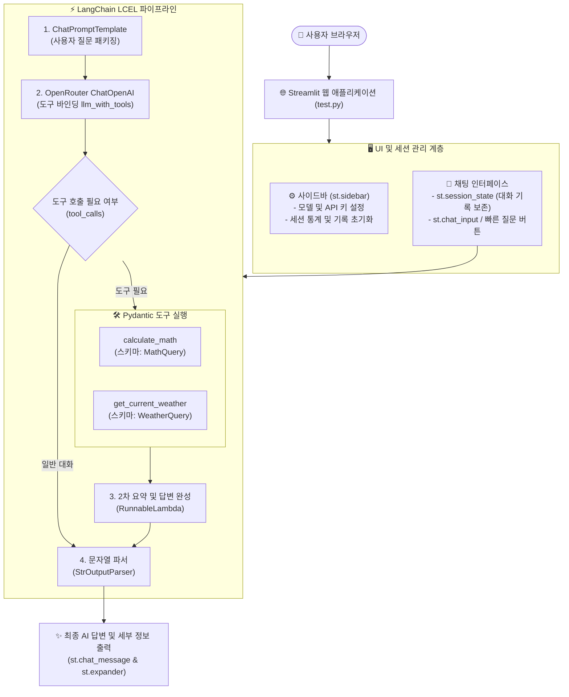
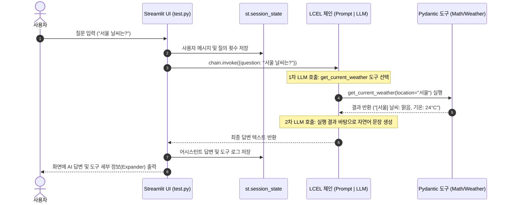

# test.py 구조도 및 Streamlit + LCEL 가이드

`test.py`는 **Streamlit 웹 UI**, **`st.session_state` 세션 관리**, **Pydantic 스키마(`MathQuery`, `WeatherQuery`)**, 그리고 **LangChain LCEL 파이프라인**을 결합한 지능형 AI 도구 에이전트 시스템입니다.

---

## 1. 전체 시스템 아키텍처 (Mermaid Flowchart)



---

## 2. 대화 및 도구 호출 시퀀스 (Mermaid Sequence Diagram)



---

## 3. 핵심 구성 요소 상세 설명

| 계층 (Layer) | 구성 요소 | 역할 및 기능 |
| :--- | :--- | :--- |
| **세션 관리** | `st.session_state` | 새로고침 후에도 대화 내역(`messages`), 질의 횟수(`query_count`), 도구 사용 통계(`tool_usage_stats`)를 안전하게 유지 |
| **설정 UI** | `st.sidebar` | OpenRouter 모델 변경, API Key 입력, Temperature 조절, 대화 기록 다운로드 및 초기화 |
| **입력 스키마** | `MathQuery`, `WeatherQuery` | Pydantic `BaseModel`을 상속받아 AI가 도구를 호출할 때 필요한 파라미터 규격을 검증 |
| **도구 정의** | `@tool(args_schema=...)` | 파이썬 함수에 스키마를 바인딩하여 LLM이 사용할 수 있는 전용 툴로 변환 |
| **파이프라인** | **LCEL Chain** | `Prompt | LLM | RunnableLambda | Parser` 파이프 연산자로 데이터 흐름을 한 줄로 연결 |

---

## 4. LCEL 파이프라인 코드 요약

```python
# 파이프(|)로 연결된 직관적인 데이터 파이프라인
chain = (
    prompt                                     # 1. 프롬프트 생성
    | llm_with_tools                           # 2. 도구가 바인딩된 LLM 모델 호출
    | RunnableLambda(execute_tools_and_summarize) # 3. 도구 실행 및 최종 답변 합성
    | StrOutputParser()                        # 4. 순수 문자열 추출
)
```
